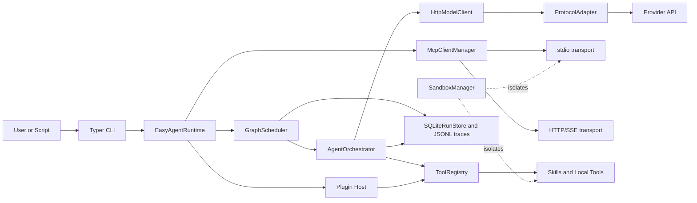
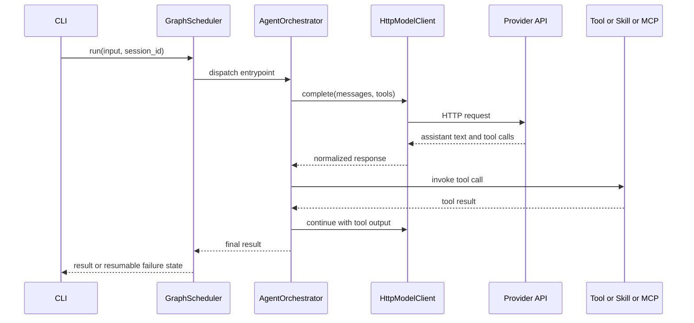

# easy-agent

[English](./README.md) | [简体中文](./README.zh-CN.md)

`easy-agent` is a white-box, business-agnostic, extensible agent engineering foundation for Python. It focuses on the runtime layer instead of domain logic, so teams, sub-agents, skills, MCP servers, plugins, session memory, and future protocol changes can be mounted without coupling the framework to a specific product.

## Tech Stack

<table>
  <tr>
    <td valign="top" width="25%">
      <strong>Runtime</strong><br>
      <br>
      <br>
      <br>
      
    </td>
    <td valign="top" width="25%">
      <strong>Agent Core</strong><br>
      <br>
      <br>
      <br>
      
    </td>
    <td valign="top" width="25%">
      <strong>Integration</strong><br>
      <br>
      <br>
      <br>
      
    </td>
    <td valign="top" width="25%">
      <strong>State & Quality</strong><br>
      <br>
      <br>
      <br>
      
    </td>
  </tr>
</table>

## Why This Project Exists

- Keep the framework white-box and easy to extend.
- Separate agent engineering concerns from business logic.
- Provide one runtime that can host direct tools, skills, MCP, plugins, teams, session memory, and graph workflows.
- Keep the design easy to evolve as protocols and agent patterns improve.

## Features

- White-box runtime assembly with explicit scheduler, orchestrator, registry, storage, and protocol layers.
- Protocol-adapted model requests for `OpenAI`, `Anthropic`, and `Gemini` style payloads.
- Tool Calling 2.0 oriented runtime with direct tools, command skills, Python hook skills, MCP tools, and plugin mounting.
- `single_agent`, `sub_agent`, `multi_agent_graph`, and `Agent Teams` collaboration modes.
- Session-oriented memory with explicit `session_id` support for durable message history and shared graph state.
- Resumable checkpoints for long-running graph workflows and top-level team workflows.
- Sandboxed execution for command skills and `stdio` MCP with Windows fallback handling.
- SQLite + JSONL trace persistence plus structured node and runtime events.

## Current Architecture

### Runtime Topology



### Communication Flow



### Current Communication Model

- Model calls go through `HttpModelClient`, then through a protocol adapter for `OpenAI`, `Anthropic`, or `Gemini` style payloads.
- Skills register as runtime tools through Python hooks or local command wrappers.
- MCP communication currently supports `stdio` and `HTTP/SSE` in the implemented codebase.
- Runtime traces, session messages, shared session state, and checkpoints are persisted into SQLite plus JSONL trace files.
- Sandboxing is applied around command skills and `stdio` MCP where configured.

## State, Memory, and Recovery

- Direct agent and top-level team runs can reuse prior conversation context by passing `--session-id`.
- Graph runs persist `shared_state` under the same `session_id`, so later runs can continue from durable graph context.
- Graph checkpoints are created at graph start and after each successful node.
- Top-level team checkpoints are created at team start and after each completed turn.
- `easy-agent resume <run_id>` restores the latest checkpoint for resumable graph and top-level team runs.

## Project Layout

```text
src/
  agent_cli/           CLI entrypoints and commands
  agent_common/        shared models and tool abstractions
  agent_config/        typed config models and validation
  agent_graph/         orchestration, graph scheduling, team runtime
  agent_integrations/  skills, MCP, plugins, sandbox, storage
  agent_protocols/     protocol adapters and model client
  agent_runtime/       runtime assembly, benchmarks, long-run flows
skills/
  examples/            local demo skills
  real/                real validation skills
configs/
  longrun.example.yml  real MCP + skill validation
  teams.example.yml    Agent Teams examples
scripts/
  benchmark_modes.py   live benchmark for six execution modes
  windows/             easy-agent.ps1 / easy-agent.bat
tests/
  unit/                fast isolated unit tests
  integration/         live-service integration tests
```

## Collaboration Modes

- `single_agent`: one agent uses tools directly.
- `sub_agent`: one coordinator delegates focused work through `subagent__*` tools.
- `multi_agent_graph`: graph nodes schedule multiple agents and join outputs.
- `Agent Teams`:
  - `round_robin`
  - `selector`
  - `swarm`

## Plugins, Skills, and MCP

```python
from pathlib import Path

from agent_runtime.runtime import build_runtime

runtime = build_runtime('easy-agent.yml')
runtime.load(Path('skills/examples'))
runtime.load('third_party_plugin')
```

Supported mounting paths:

- local skill directories
- plugin manifests such as `plugin.yaml` or `easy-agent-plugin.yaml`
- Python package entry points in `agent_runtime.plugins`
- configured MCP servers from YAML config

## Quick Start

### Environment

```powershell
uv venv --python 3.12
uv sync --dev
```

### Local Credentials

The runtime supports a local-only `.env.local` file. Use it for machine-specific secrets so you do not need to export environment variables every time.

Example keys:

```dotenv
DEEPSEEK_API_KEY=your-key
PG_HOST=127.0.0.1
PG_PORT=5432
PG_USER=postgres
PG_PASSWORD=your-password
PG_DATABASE=postgres
REDIS_URL=redis://127.0.0.1:6379/0
```

### Common Commands

```powershell
uv run easy-agent doctor -c easy-agent.yml
uv run easy-agent skills list -c easy-agent.yml
uv run easy-agent plugins list -c easy-agent.yml
uv run easy-agent teams list -c configs/teams.example.yml
uv run easy-agent run "summarize the repository" --session-id demo-session -c easy-agent.yml
uv run easy-agent resume <run_id> -c configs/teams.example.yml
uv run python scripts/benchmark_modes.py --config easy-agent.yml --repeat 1
```

### Windows Launchers

```powershell
powershell -ExecutionPolicy Bypass -File scripts/windows/easy-agent.ps1 --help
cmd /c scripts/windows/easy-agent.bat --help
```

## Real Usage Results

The current live benchmark baseline comes from `.easy-agent/benchmark-report.json` using DeepSeek through the OpenAI-compatible path.

| Mode | Success | Avg Seconds | Avg Tool Calls | Avg SubAgent Calls |
| --- | --- | ---: | ---: | ---: |
| `single_agent` | 1/1 | 6.1493 | 1 | 0 |
| `sub_agent` | 1/1 | 20.6691 | 1 | 1 |
| `multi_agent_graph` | 1/1 | 14.4803 | 2 | 0 |
| `team_round_robin` | 1/1 | 11.2187 | 1 | 0 |
| `team_selector` | 1/1 | 15.1416 | 1 | 0 |
| `team_swarm` | 1/1 | 11.0792 | 2 | 0 |

## Future Engineering Improvements

The current implementation now includes durable session memory and resumable checkpoints. The next useful upgrades are:

- Add explicit guardrail hooks before tool execution and before final output emission.
- Add richer tracing and event streaming across agent, team, tool, and MCP boundaries.
- Keep team orchestration patterns explicit and typed instead of hiding them behind one generic loop.
- Modernize remote MCP transport in a future round while keeping the current implementation truthful in docs today.

Reference material:

- OpenAI Agents SDK Sessions: <https://openai.github.io/openai-agents-python/sessions/>
- OpenAI Agents SDK Handoffs: <https://openai.github.io/openai-agents-python/handoffs/>
- OpenAI Agents SDK Guardrails: <https://openai.github.io/openai-agents-python/guardrails/>
- OpenAI Agents SDK Tracing: <https://openai.github.io/openai-agents-python/tracing/>
- AutoGen Teams: <https://microsoft.github.io/autogen/stable/user-guide/agentchat-user-guide/tutorial/teams.html>
- AutoGen Selector Group Chat: <https://microsoft.github.io/autogen/stable/user-guide/agentchat-user-guide/selector-group-chat.html>
- AutoGen Swarm: <https://microsoft.github.io/autogen/stable/user-guide/agentchat-user-guide/swarm.html>
- LangGraph Durable Execution: <https://docs.langchain.com/oss/python/langgraph/durable-execution>
- LangGraph Memory: <https://docs.langchain.com/oss/python/langgraph/memory>
- MCP Transports: <https://modelcontextprotocol.io/docs/concepts/transports>

## Testing

```powershell
uv run ruff check src tests scripts
uv run mypy src tests scripts
uv run python -m pytest tests/unit -q
uv run python -m pytest tests/integration -m real -q
```

For the full live suite, local PostgreSQL and Redis credentials must be available in `.env.local` or environment variables.

## Acknowledgements

- <a href="https://linux.do/"></a> [Linux.do](https://linux.do/) for community discussion and open knowledge sharing.
- [](https://www.deepseek.com/) for the real verification baseline and model endpoint.

## License

MIT
