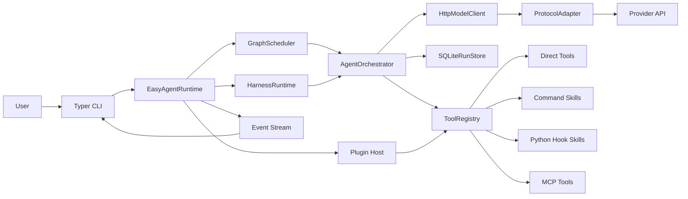
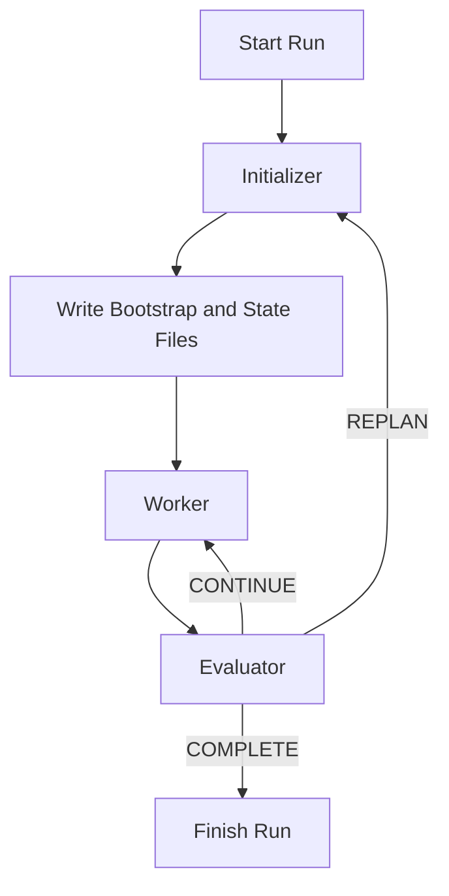

# easy-agent

[English](./README.md) | [简体中文](./README.zh-CN.md)

`easy-agent` is a white-box Python foundation for building agent systems that you can actually inspect, test, and extend.

It is not a business-specific app. It is the runtime layer underneath one. The project gives you a stable place to run single agents, sub-agents, multi-agent graphs, teams, tools, skills, MCP servers, plugins, and now long-running harnesses without hard-coding product logic into the framework.

Current release line: `0.3.x`. The latest published patch remains `0.3.2`; this snapshot also covers the current unreleased hardening work on top of that release.

## What This Project Is

Many agent repositories jump straight from "call a model" to "ship a product". That makes the middle messy: tool calling drifts, long tasks become prompt soup, state is hard to resume, and protocol changes leak into business code.

`easy-agent` exists to keep that middle layer explicit.

- It separates runtime engineering from business logic.
- It keeps orchestration visible instead of hiding it behind opaque abstractions.
- It lets you mount new tools, skills, MCP servers, and plugins without rewriting the core.
- It gives long-running work a real harness instead of relying on one giant prompt.

## Who It Is For

- Teams building agent products that need a reusable runtime, not a one-off demo.
- Engineers who want direct control over scheduling, tools, state, and protocol adaptation.
- Projects that need to evolve with provider APIs, tool schemas, MCP, or multi-agent patterns over time.

## What You Get

- A white-box runtime with explicit `scheduler`, `orchestrator`, `registry`, `storage`, and `protocol adapter` layers.
- One runtime for `single_agent`, `sub_agent`, graph workflows, and `Agent Teams`.
- A first-class long-running harness with `initializer -> worker -> evaluator` loops, resumable checkpoints, and durable artifacts.
- A unified model-call surface for `OpenAI`, `Anthropic`, and `Gemini` style payloads.
- A Tool Calling 2.0 runtime that can host direct tools, command skills, Python hook skills, MCP tools, and mounted plugins.
- Built-in session memory, tracing, event streaming, guardrails, human approvals, replay tooling, A2A-style federation, isolated workbench execution, and public evaluation helpers.

## Tech Stack

<table>
  <tr>
    <td valign="top" width="25%">
      <strong>Runtime</strong><br>
      <br>
      <br>
      <br>
      
    </td>
    <td valign="top" width="25%">
      <strong>Model Layer</strong><br>
      <br>
      <br>
      <br>
      
    </td>
    <td valign="top" width="25%">
      <strong>Execution</strong><br>
      <br>
      <br>
      <br>
      
    </td>
    <td valign="top" width="25%">
      <strong>Integration</strong><br>
      <br>
      <br>
      <br>
      
    </td>
  </tr>
</table>

## Features

- Explicit runtime layering so the scheduler, orchestrator, tool registry, storage, and protocol adapters stay inspectable.
- Unified protocol adaptation for `OpenAI`, `Anthropic`, and `Gemini` style model payloads.
- Tool Calling 2.0 support for direct tools, command skills, Python hook skills, MCP tools, and plugin mounting.
- `single_agent`, `sub_agent`, `multi_agent_graph`, and `Agent Teams` collaboration modes.
- Long-running harnesses with durable artifacts, explicit completion contracts, evaluator-driven continue or replan decisions, resumable checkpoints, and approval-aware resume gates.
- Session-oriented memory for direct runs, top-level teams, and harness state reuse.
- Human approval workflows plus safe-point interrupts for sensitive tools, swarm handoffs, harness resumes, and MCP sampling or elicitation requests.
- Guardrail hooks before tool execution and before final output emission.
- Schema-aware tool validation with a repair loop when the model emits invalid arguments.
- Event streaming and tracing across agent, team, tool, guardrail, harness, and MCP boundaries.
- SQLite plus JSONL persistence for runs, traces, checkpoints, session state, harness state, approval requests, interrupts, and resume lineage.
- Historical checkpoint listing, time-travel replay, and branchable `--fork` resume for graph and team workflows.
- A2A-style remote agent federation with exported local targets, remote inspection, task send or stream flows, durable task state, and CLI federation tooling.
- Executor and workbench isolation for long-lived command skills, MCP subprocesses, execution manifests, TTL cleanup, and fork-safe resume snapshots.
- MCP roots, risk-aware sampling and elicitation approvals, richer form or URL elicitation handling, `streamable_http`, and authorization-aware remote transports with persisted OAuth state.
- Public evaluation helpers for BFCL subset cases and tau2 mock cases, with provider-aware fallback telemetry for OpenAI-compatible schema failures.

## Human Loop, Replay, and MCP

The current runtime already ships the reliability controls that were previously only listed as roadmap work.

- Sensitive tools can pause for human approval before execution, and swarm handoffs plus harness resumes can pause on the same human loop.
- Runs expose safe-point interrupts, approval queues, checkpoint listing, historical replay, and branchable `resume --fork` flows.
- MCP integrations now support explicit roots, backward-compatible filesystem root inference for stdio servers, risk-aware sampling callbacks, richer form or URL elicitation callbacks, `streamable_http`, and auth-aware remote transports with persisted OAuth state.
- High-risk MCP sampling and URL elicitation requests are forced into deferred approval instead of silently bypassing the human loop, and the CLI exposes `approvals`, `checkpoints`, `replay`, `interrupt`, `mcp roots`, and `mcp auth` commands so these controls stay usable without custom code.

## A2A Remote Agent Federation

`easy-agent` now ships a more durable A2A-style federation layer instead of a polling-only bridge.

- `federation.server` can publish local agents, teams, or harnesses as exported targets.
- `federation.remotes` can inspect remote cards and prefer SSE push or fall back to polling with `push_preference = auto|sse|poll`.
- Federated delivery now includes well-known discovery, persisted task event logs, SSE event streaming, webhook push delivery, retry with backoff, lease renewal, cancellation, `pushNotificationConfig` set/get/list/delete compatibility, and reconnect-safe `sendSubscribe` or resubscribe flows.
- `agent-card` and `extended-agent-card` now expose protocol version, card schema version, modalities, declared capabilities, auth hints, retry policy, subscribe policy, well-known endpoints, and compatibility metadata.
- Federated task state plus subscription state is persisted in SQLite so remote execution, backlog replay, and push delivery can be inspected after the initial request completes.
- The CLI now exposes `easy-agent federation list|inspect|tasks|events|cancel-task|subscriptions|renew-subscription|cancel-subscription|push-set|push-get|push-list|push-delete|send-subscribe|resubscribe|serve`.

Example shape:

```yaml
federation:
  server:
    enabled: true
    host: <LOCAL_HOST>
    port: 8787
    base_path: /a2a
    public_url: https://agent.example.com/a2a
    protocol_version: "0.3"
    card_schema_version: "1.0"
    retry_max_attempts: 4
    retry_initial_backoff_seconds: 0.5
  exports:
    - name: repo_delivery
      target_type: harness
      target: delivery_loop
      modalities: [text]
      capabilities: [streaming, interrupts]
  remotes:
    - name: partner
      base_url: https://partner.example.com/a2a
      push_preference: auto
      auth:
        type: bearer_env
        token_env: PARTNER_AGENT_TOKEN
```

## Executor / Workbench Isolation

The runtime now has a dedicated executor or workbench layer for long-lived code execution, tool runs, and environment tasks.

- `WorkbenchManager` provisions per-run isolated roots under `.easy-agent/workbench` and persists backend runtime state alongside each session.
- `executors` now support `process`, `container`, and `microvm` backends behind the same workbench interface.
- The `container` backend can now preload offline archives, auto-build from a bootstrap context, enforce `memory` or `cpu` quotas, and restore from a committed snapshot image for repeatable host validation.
- The `microvm` backend now supports both classic `qemu` and a `podman_machine` SSH-backed provider so the same isolation surface can be exercised on hosts that already have Podman machine assets.
- Command skills and stdio MCP servers can opt into a named executor through `skill.metadata.executor` or `mcp[*].executor` and then reuse the same long-lived session.
- Graph and harness checkpoints capture workbench manifests, and forked resume clones those manifests into new session roots without discarding the original lineage.
- SQLite persists `workbench_sessions`, `workbench_executions`, runtime-state payloads, federated task state, and executor reuse metadata for later inspection.
- The real-network suite now exercises process reuse, offline container restore, and podman-machine microVM recovery as real host coverage instead of leaving those rows as `skipped`.
- The CLI now exposes `easy-agent workbench list` and `easy-agent workbench gc`.

## Architecture

The runtime is intentionally white-box. The important layers are visible and replaceable.

- `scheduler` runs direct-agent and graph workflows.
- `harness` runs long tasks through explicit initializer, worker, and evaluator phases.
- `orchestrator` executes agent and team turns.
- `registry` exposes direct tools, skills, MCP tools, and mounted plugin tools.
- `storage` persists runs, traces, checkpoints, session state, and harness state.
- `protocol adapters` normalize provider-specific request and response shapes.

### Runtime Topology



## Long-Running Harness Design

Long-running work should not depend on a single giant prompt. In this repository, a harness is a first-class runtime capability.

Each harness defines:

- an `initializer_agent`
- a `worker_target` that can be an agent or a team
- an `evaluator_agent`
- an explicit `completion_contract`
- durable artifact paths
- bounded `max_cycles` and `max_replans`

The harness writes three durable files per session:

- `bootstrap.md`: human-readable kickoff and recovery instructions
- `progress.md`: cycle-by-cycle progress log
- `features.json`: machine-readable state, decisions, and counters

### Harness Loop



The harness design is informed by Anthropic's article [Effective harnesses for long-running agents](https://www.anthropic.com/engineering/effective-harnesses-for-long-running-agents) published on November 26, 2025. The key idea is simple: long tasks need explicit coordination code, clear completion checks, and recoverable artifacts, not just a stronger model.

## Protocol and Tool Model

### Model Protocols

- `OpenAI` style payloads, including OpenAI-compatible providers such as DeepSeek.
- `Anthropic` style payloads.
- `Gemini` style payloads.

### Tool Calling 2.0 Runtime

The runtime can expose tools from multiple sources through one registry:

- direct in-process tools
- command skills
- Python hook skills
- MCP tools over `stdio`, `HTTP/SSE`, or `streamable_http`
- mounted plugins from local paths, manifests, or entry points

## Project Layout

```text
src/
  agent_cli/           CLI entrypoints and commands
  agent_common/        shared models and tool abstractions
  agent_config/        typed config models and validation
  agent_graph/         orchestration, graph scheduling, team runtime
  agent_integrations/  skills, MCP, plugins, sandbox, storage, guardrails, federation, workbench
  agent_protocols/     protocol adapters and model client
  agent_runtime/       runtime assembly, harnesses, benchmarks, long-run flows, public eval
skills/
  examples/            local demo skills
  real/                real validation skills
configs/
  harness.example.yml  long-running harness example
  longrun.example.yml  real MCP + skill validation
  teams.example.yml    Agent Teams examples
tests/
  unit/                fast isolated tests
  integration/         live-service integration tests
```

## Quick Start

### Environment

```powershell
uv venv --python 3.12
uv sync --dev
```

### Local Credentials

The runtime auto-loads a local-only `.env.local` file. This keeps machine-specific secrets out of tracked files while avoiding repeated manual exports.

Example:

```dotenv
DEEPSEEK_API_KEY=your-key
PG_HOST=<LOCAL_HOST>
PG_PORT=5432
PG_USER=postgres
PG_PASSWORD=your-password
PG_DATABASE=postgres
REDIS_URL=redis://<LOCAL_HOST>:6379/0
```

### Common Commands

```powershell
uv run easy-agent doctor -c easy-agent.yml
uv run easy-agent skills list -c easy-agent.yml
uv run easy-agent plugins list -c easy-agent.yml
uv run easy-agent teams list -c configs/teams.example.yml
uv run easy-agent harness list -c configs/harness.example.yml
uv run easy-agent federation list -c easy-agent.yml
uv run easy-agent workbench list -c easy-agent.yml
uv run easy-agent run "summarize the repository" --session-id demo-session --approval-mode deferred -c easy-agent.yml
uv run easy-agent approvals list --status pending -c easy-agent.yml
uv run easy-agent checkpoints <run_id> -c configs/teams.example.yml
uv run easy-agent replay <run_id> --checkpoint-id <checkpoint_id> -c configs/teams.example.yml
uv run easy-agent resume <run_id> --checkpoint-id <checkpoint_id> --fork -c configs/teams.example.yml
uv run easy-agent interrupt <run_id> --reason "human stop" -c configs/teams.example.yml
uv run easy-agent harness run delivery_loop "Create a release summary for this repository" -c configs/harness.example.yml --session-id demo-harness --approval-mode deferred
uv run easy-agent harness resume <run_id> -c configs/harness.example.yml --approval-mode deferred
uv run easy-agent mcp roots list filesystem -c configs/longrun.example.yml
uv run easy-agent mcp auth status filesystem -c configs/longrun.example.yml
```

### Local GitHub Automation Skill Pack

The default `easy-agent.yml` now reserves an optional local-only skill root at `.easy-agent/local-skills/github_automation`.

- When that local skill pack exists, the coordinator starts with `github_issue_list`, `github_issue_prepare_fix`, `git_commit_local`, and `github_release_publish` ahead of the generic demo tools.
- The pack is intentionally untracked so repo-specific delivery automation can stay private to one checkout.
- `github_issue_prepare_fix` prepares a branch plus a task package under `.easy-agent/github-automation/issues/<number>/` instead of silently editing code.
- Install GitHub CLI first and authenticate it locally before using those skills: `gh --version` and `gh auth login`.

### Python Runtime Example

```python
from pathlib import Path

from agent_runtime.runtime import build_runtime

runtime = build_runtime('configs/harness.example.yml')
runtime.load(Path('skills/examples'))
runtime.load('third_party_plugin')
```

## What a Harness Run Produces

A successful harness run does more than return text.

- It persists run metadata and checkpoints in SQLite.
- It streams runtime events for CLI or observer consumption.
- It writes `bootstrap.md`, `progress.md`, and `features.json` so a later run can resume from explicit state.
- It can reuse prior harness state when you pass the same `--session-id`.

## Verification

The repository currently uses these verification paths on this machine:

```powershell
.\.venv\Scripts\ruff.exe check src tests scripts
.\.venv\Scripts\mypy.exe src tests scripts
.\.venv\Scripts\python.exe -m pytest tests/unit -q --basetemp=%TEMP%\easy-agent-pytest\unit-full-<timestamp>
.\.venv\Scripts\python.exe -m pytest tests/integration -m real -q --basetemp=%TEMP%\easy-agent-pytest\integration-full-<timestamp>
.\.venv\Scripts\python.exe scripts\benchmark_modes.py --config easy-agent.yml --repeat 1 --output .easy-agent\benchmark-report.json
.\.venv\Scripts\python.exe -  # helper script calling run_public_eval_suite('easy-agent.yml')
.\.venv\Scripts\python.exe -  # helper script calling run_real_network_suite()
```

Python CLI smoke is also verified through `CliRunner` against `agent_cli.app:app` for `--help`, `doctor`, `teams list`, `harness list`, and `federation list`.

## Real Network Test Set Results

Snapshot date: March 30, 2026.

This snapshot combines fresh static checks, a fresh focused real-network pytest pass, and a repo-local Python manual verification pass from March 30, 2026. The real-network matrix below was regenerated on March 30, 2026, while the benchmark artifact remains the retained March 27, 2026 snapshot and the public-eval artifact remains the retained March 30, 2026 live snapshot.

### Python Verification Snapshot

| Suite | Command | Result |
| --- | --- | --- |
| Static checks | `.\.venv\Scripts\python.exe -m ruff check src tests scripts` | passed |
| Typing | `.\.venv\Scripts\python.exe -m mypy src tests scripts` | passed |
| Focused real-network pytest | `.\.venv\Scripts\python.exe -m pytest tests/integration/test_real_network_eval.py -m real -q` | `1 passed` |
| Targeted manual Python verification | repo-local script writing `.easy-agent/manual-verify/20260330-github-fed/manual-verification-report.json` | passed |
| Live real-network artifact | `.easy-agent/real-network-report.json` | refreshed on March 30, 2026 |
| Live benchmark artifact | `.easy-agent/benchmark-report.json` | retained March 27, 2026 snapshot |
| Live public-eval artifact | `.easy-agent/public-eval-report.json` | retained March 30, 2026 snapshot |

The manual Python verification pass covered the new GitHub automation helpers, optional local skill loading, duplicate-call suppression for optional-only argument supersets, tau history grounding helpers, and federation auto-discovery before `run_remote()`.

### Real Network Matrix

| Scenario | Transport | Status | Duration (s) | Notes |
| --- | --- | --- | --- | --- |
| `cross_process_federation` | `http_poll` | passed | `0.7481` | cross-process well-known discovery and send/poll federation passed |
| `live_model_federation_roundtrip` | `http_poll` | skipped | `6.9997` | live-model loopback path reached the new row, but the provider connection failed in this session before the remote agent could answer |
| `disconnect_retry_chaos` | `http_webhook` | passed | `4.1800` | callback retry, `pushNotificationConfig`, `sendSubscribe`, and resubscribe passed |
| `duplicate_delivery_replay_resilience` | `http_webhook` | passed | `3.6405` | duplicate delivery and replay reads preserved a stable federated task event log |
| `workbench_reuse_process` | `local_process` | passed | `2.3959` | process workbench reused the same long-lived session root |
| `workbench_reuse_container` | `podman_exec` | skipped | `3.4967` | host Podman credentials were not readable in this session |
| `workbench_incremental_snapshot_reuse_container` | `podman_exec` | skipped | `3.4215` | host Podman credentials were not readable in this session |
| `workbench_reuse_microvm` | `podman_machine_ssh` | skipped | `0.1807` | podman-machine lock or identity paths were denied on this host |
| `workbench_incremental_snapshot_reuse_microvm` | `podman_machine_ssh` | skipped | `0.1905` | podman-machine lock or identity paths were denied on this host |
| `replay_resume_failure_injection` | `sqlite_checkpoint` | passed | `9.0014` | resume, replay, and fork recovery passed under injected failure |

Summary: `5 passed`, `0 failed`, `5 skipped`.
Source: `.easy-agent/real-network-report.json` generated at `2026-03-30T07:29:01Z`.

### Live Benchmark Snapshot

| Mode | Success | Average Duration (s) |
| --- | --- | --- |
| `single_agent` | yes | `5.9261` |
| `sub_agent` | yes | `18.7510` |
| `multi_agent_graph` | yes | `15.8392` |
| `team_round_robin` | yes | `12.9947` |
| `team_selector` | yes | `16.9389` |
| `team_swarm` | yes | `4.9341` |

Source: latest checked `.easy-agent/benchmark-report.json` artifact retained from the March 27, 2026 `0.3.2` verification pass.

### Public Eval Snapshot

| Suite | Pass Rate | Notes |
| --- | --- | --- |
| `bfcl_simple` | `0.8750` | 7 of 8 cases passed |
| `bfcl_multiple` | `0.8750` | 7 of 8 cases passed |
| `bfcl_parallel_multiple` | `0.7500` | 3 of 4 cases passed |
| `bfcl_irrelevance` | `1.0000` | 4 of 4 cases passed |
| `tau2_mock` | `0.6667` | 2 of 3 cases passed |
| `overall.bfcl_pass_rate` | `0.8750` | provider-aware fallback recovered the prior OpenAI-compatible schema failures; the remaining misses are behavior-level over-calls rather than provider `400`s |

Source: `.easy-agent/public-eval-report.json` retained from the March 30, 2026 live refresh.

Current caveats:

- The current Windows sandbox session still blocks pytest-managed temp roots for many `tmp_path`-heavy unit cases, so this round used repo-local Python verification to cover the changed unit surfaces directly.
- The new live-model federation row is now present and exercised, but the provider connection failed in this session, so the row landed as `skipped` rather than `passed`.
- Container and microVM snapshot rows are present and exercised, but host Podman or machine credentials were denied on this machine, so those rows remain `skipped`.
- The retained public-eval snapshot is still the latest live scorecard; this round's public-eval changes were validated through targeted Python helper coverage rather than a fresh external-network refresh.

## Next Reinforcement

These next steps are based on the current public A2A and MCP protocol surfaces, not just internal backlog notes.

- Push federation card and task negotiation closer to the latest public A2A surface by adding richer artifact or part-level modality declarations, `ListTasks` or `ListTaskEvents` cursor pagination (`pageToken` / `nextPageToken`), and clearer notification compatibility metadata around push delivery.
- Harden federation security toward production-grade remote trust with stronger auth scheme hints, signed callback verification, OAuth or OIDC flows, callback audience validation, and optional mTLS between agent servers.
- Expand MCP capability negotiation from the current roots support to full `roots/list_changed` flows plus stronger `streamable_http` reconnect, auth-refresh, and server-initiated lifecycle handling.
- Extend MCP sampling and elicitation beyond the current text-first bridge so low-risk requests can preserve richer structured content blocks or form payloads when the provider and runtime support them, while high-risk remote requests remain deferred behind human approval.
- Add stage-aware public-eval analytics, per-provider schema compatibility matrices, and stronger regression fixtures for duplicate-call suppression, history-grounding, and OpenAI-compatible fallback paths.
- Turn the newly added real-network rows from `skipped` into stable `passed` coverage on provisioned hosts by preflighting live-model connectivity, Podman identity access, and container or microVM delta-snapshot warm caches.

## Design References

- Anthropic, [Effective harnesses for long-running agents](https://www.anthropic.com/engineering/effective-harnesses-for-long-running-agents)
- OpenAI Agents SDK Sessions: [https://openai.github.io/openai-agents-python/sessions/](https://openai.github.io/openai-agents-python/sessions/)
- OpenAI Agents SDK Handoffs: [https://openai.github.io/openai-agents-python/handoffs/](https://openai.github.io/openai-agents-python/handoffs/)
- OpenAI Agents SDK Guardrails: [https://openai.github.io/openai-agents-python/guardrails/](https://openai.github.io/openai-agents-python/guardrails/)
- OpenAI Agents SDK Tracing: [https://openai.github.io/openai-agents-python/tracing/](https://openai.github.io/openai-agents-python/tracing/)
- AutoGen Teams: [https://microsoft.github.io/autogen/stable/user-guide/agentchat-user-guide/tutorial/teams.html](https://microsoft.github.io/autogen/stable/user-guide/agentchat-user-guide/tutorial/teams.html)
- LangGraph Durable Execution: [https://docs.langchain.com/oss/python/langgraph/durable-execution](https://docs.langchain.com/oss/python/langgraph/durable-execution)
- A2A Protocol: [https://a2aprotocol.ai/](https://a2aprotocol.ai/)
- A2A Latest Specification: [https://a2a-protocol.org/latest/specification/](https://a2a-protocol.org/latest/specification/)
- A2A Reference Implementation: [https://github.com/a2aproject/A2A](https://github.com/a2aproject/A2A)
- MCP Roots: [https://modelcontextprotocol.io/docs/concepts/roots](https://modelcontextprotocol.io/docs/concepts/roots)
- MCP Sampling: [https://modelcontextprotocol.io/docs/concepts/sampling](https://modelcontextprotocol.io/docs/concepts/sampling)
- MCP Elicitation: [https://modelcontextprotocol.io/docs/concepts/elicitation](https://modelcontextprotocol.io/docs/concepts/elicitation)
- MCP Transports: [https://modelcontextprotocol.io/docs/concepts/transports](https://modelcontextprotocol.io/docs/concepts/transports)

## Acknowledgements

- [Linux.do](https://linux.do/) for community discussion and open knowledge sharing.
- [](https://www.deepseek.com/) for the live verification baseline and model endpoint.

## License

[Apache-2.0](https://github.com/CloudWide851/easy-agent?tab=Apache-2.0-1-ov-file#)

