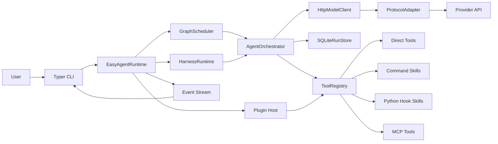
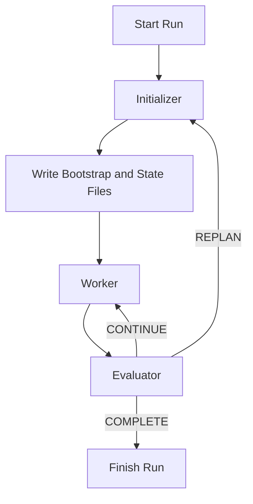

# easy-agent

[English](./README.md) | [简体中文](./README.zh-CN.md)

`easy-agent` is a white-box Python foundation for building agent systems that you can actually inspect, test, and extend.

It is not a business-specific app. It is the runtime layer underneath one. The project gives you a stable place to run single agents, sub-agents, multi-agent graphs, teams, tools, skills, MCP servers, plugins, and now long-running harnesses without hard-coding product logic into the framework.

## What This Project Is

Many agent repositories jump straight from "call a model" to "ship a product". That makes the middle messy: tool calling drifts, long tasks become prompt soup, state is hard to resume, and protocol changes leak into business code.

`easy-agent` exists to keep that middle layer explicit.

- It separates runtime engineering from business logic.
- It keeps orchestration visible instead of hiding it behind opaque abstractions.
- It lets you mount new tools, skills, MCP servers, and plugins without rewriting the core.
- It gives long-running work a real harness instead of relying on one giant prompt.

## Who It Is For

- Teams building agent products that need a reusable runtime, not a one-off demo.
- Engineers who want direct control over scheduling, tools, state, and protocol adaptation.
- Projects that need to evolve with provider APIs, tool schemas, MCP, or multi-agent patterns over time.

## What You Get

- A white-box runtime with explicit `scheduler`, `orchestrator`, `registry`, `storage`, and `protocol adapter` layers.
- One runtime for `single_agent`, `sub_agent`, graph workflows, and `Agent Teams`.
- A first-class long-running harness with `initializer -> worker -> evaluator` loops, resumable checkpoints, and durable artifacts.
- A unified model-call surface for `OpenAI`, `Anthropic`, and `Gemini` style payloads.
- A Tool Calling 2.0 runtime that can host direct tools, command skills, Python hook skills, MCP tools, and mounted plugins.
- Built-in session memory, tracing, event streaming, guardrails, and public evaluation helpers.

## Tech Stack

<table>
  <tr>
    <td valign="top" width="25%">
      <strong>Runtime</strong><br>
      <br>
      <br>
      <br>
      
    </td>
    <td valign="top" width="25%">
      <strong>Model Layer</strong><br>
      <br>
      <br>
      <br>
      
    </td>
    <td valign="top" width="25%">
      <strong>Execution</strong><br>
      <br>
      <br>
      <br>
      
    </td>
    <td valign="top" width="25%">
      <strong>Integration</strong><br>
      <br>
      <br>
      <br>
      
    </td>
  </tr>
</table>

## Features

- Explicit runtime layering so the scheduler, orchestrator, tool registry, storage, and protocol adapters stay inspectable.
- Unified protocol adaptation for `OpenAI`, `Anthropic`, and `Gemini` style model payloads.
- Tool Calling 2.0 support for direct tools, command skills, Python hook skills, MCP tools, and plugin mounting.
- `single_agent`, `sub_agent`, `multi_agent_graph`, and `Agent Teams` collaboration modes.
- Long-running harnesses with durable artifacts, explicit completion contracts, evaluator-driven continue or replan decisions, and resumable checkpoints.
- Session-oriented memory for direct runs, top-level teams, and harness state reuse.
- Guardrail hooks before tool execution and before final output emission.
- Schema-aware tool validation with a repair loop when the model emits invalid arguments.
- Event streaming and tracing across agent, team, tool, guardrail, harness, and MCP boundaries.
- SQLite plus JSONL persistence for runs, traces, checkpoints, and session state.
- Public evaluation helpers for BFCL subset cases and tau2 mock cases.

## Architecture

The runtime is intentionally white-box. The important layers are visible and replaceable.

- `scheduler` runs direct-agent and graph workflows.
- `harness` runs long tasks through explicit initializer, worker, and evaluator phases.
- `orchestrator` executes agent and team turns.
- `registry` exposes direct tools, skills, MCP tools, and mounted plugin tools.
- `storage` persists runs, traces, checkpoints, session state, and harness state.
- `protocol adapters` normalize provider-specific request and response shapes.

### Runtime Topology



## Long-Running Harness Design

Long-running work should not depend on a single giant prompt. In this repository, a harness is a first-class runtime capability.

Each harness defines:

- an `initializer_agent`
- a `worker_target` that can be an agent or a team
- an `evaluator_agent`
- an explicit `completion_contract`
- durable artifact paths
- bounded `max_cycles` and `max_replans`

The harness writes three durable files per session:

- `bootstrap.md`: human-readable kickoff and recovery instructions
- `progress.md`: cycle-by-cycle progress log
- `features.json`: machine-readable state, decisions, and counters

### Harness Loop



The harness design is informed by Anthropic's article [Effective harnesses for long-running agents](https://www.anthropic.com/engineering/effective-harnesses-for-long-running-agents) published on November 26, 2025. The key idea is simple: long tasks need explicit coordination code, clear completion checks, and recoverable artifacts, not just a stronger model.

## Protocol and Tool Model

### Model Protocols

- `OpenAI` style payloads, including OpenAI-compatible providers such as DeepSeek.
- `Anthropic` style payloads.
- `Gemini` style payloads.

### Tool Calling 2.0 Runtime

The runtime can expose tools from multiple sources through one registry:

- direct in-process tools
- command skills
- Python hook skills
- MCP tools over `stdio` or `HTTP/SSE`
- mounted plugins from local paths, manifests, or entry points

## Project Layout

```text
src/
  agent_cli/           CLI entrypoints and commands
  agent_common/        shared models and tool abstractions
  agent_config/        typed config models and validation
  agent_graph/         orchestration, graph scheduling, team runtime
  agent_integrations/  skills, MCP, plugins, sandbox, storage, guardrails
  agent_protocols/     protocol adapters and model client
  agent_runtime/       runtime assembly, harnesses, benchmarks, long-run flows, public eval
skills/
  examples/            local demo skills
  real/                real validation skills
configs/
  harness.example.yml  long-running harness example
  longrun.example.yml  real MCP + skill validation
  teams.example.yml    Agent Teams examples
tests/
  unit/                fast isolated tests
  integration/         live-service integration tests
```

## Quick Start

### Environment

```powershell
uv venv --python 3.12
uv sync --dev
```

### Local Credentials

The runtime auto-loads a local-only `.env.local` file. This keeps machine-specific secrets out of tracked files while avoiding repeated manual exports.

Example:

```dotenv
DEEPSEEK_API_KEY=your-key
PG_HOST=127.0.0.1
PG_PORT=5432
PG_USER=postgres
PG_PASSWORD=your-password
PG_DATABASE=postgres
REDIS_URL=redis://127.0.0.1:6379/0
```

### Common Commands

```powershell
uv run easy-agent doctor -c easy-agent.yml
uv run easy-agent skills list -c easy-agent.yml
uv run easy-agent plugins list -c easy-agent.yml
uv run easy-agent teams list -c configs/teams.example.yml
uv run easy-agent harness list -c configs/harness.example.yml
uv run easy-agent harness run delivery_loop "Create a release summary for this repository" -c configs/harness.example.yml --session-id demo-harness
uv run easy-agent harness resume <run_id> -c configs/harness.example.yml
uv run easy-agent run "summarize the repository" --session-id demo-session -c easy-agent.yml
uv run easy-agent resume <run_id> -c configs/teams.example.yml
```

### Python Runtime Example

```python
from pathlib import Path

from agent_runtime.runtime import build_runtime

runtime = build_runtime('configs/harness.example.yml')
runtime.load(Path('skills/examples'))
runtime.load('third_party_plugin')
```

## What a Harness Run Produces

A successful harness run does more than return text.

- It persists run metadata and checkpoints in SQLite.
- It streams runtime events for CLI or observer consumption.
- It writes `bootstrap.md`, `progress.md`, and `features.json` so a later run can resume from explicit state.
- It can reuse prior harness state when you pass the same `--session-id`.

## Verification

The repository currently uses these verification paths on this machine:

```powershell
uv run ruff check src tests scripts
uv run mypy src tests scripts
uv run python -m pytest tests/unit -q
uv run python -m pytest tests/integration -m real -q
uv run easy-agent --help
uv run easy-agent doctor -c easy-agent.yml
uv run easy-agent harness list -c configs/harness.example.yml
uv run easy-agent teams list -c configs/teams.example.yml
```

For Windows, a stable pytest run should use an explicit `--basetemp` rooted under the system temporary directory.

## Design References

- Anthropic, [Effective harnesses for long-running agents](https://www.anthropic.com/engineering/effective-harnesses-for-long-running-agents)
- OpenAI Agents SDK Sessions: <https://openai.github.io/openai-agents-python/sessions/>
- OpenAI Agents SDK Handoffs: <https://openai.github.io/openai-agents-python/handoffs/>
- OpenAI Agents SDK Guardrails: <https://openai.github.io/openai-agents-python/guardrails/>
- OpenAI Agents SDK Tracing: <https://openai.github.io/openai-agents-python/tracing/>
- AutoGen Teams: <https://microsoft.github.io/autogen/stable/user-guide/agentchat-user-guide/tutorial/teams.html>
- LangGraph Durable Execution: <https://docs.langchain.com/oss/python/langgraph/durable-execution>
- MCP Transports: <https://modelcontextprotocol.io/docs/concepts/transports>

## Acknowledgements

- [Linux.do](https://linux.do/) for community discussion and open knowledge sharing.
- [](https://www.deepseek.com/) for the live verification baseline and model endpoint.

## License

MIT
