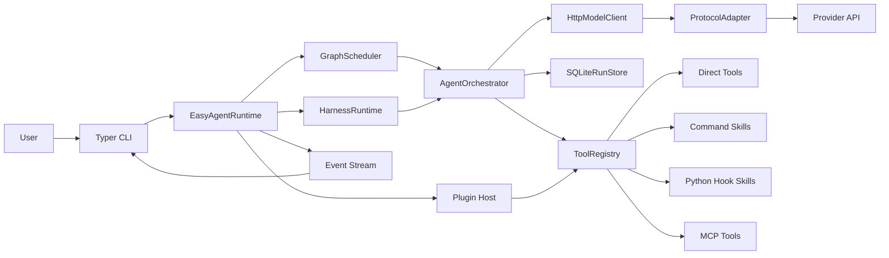
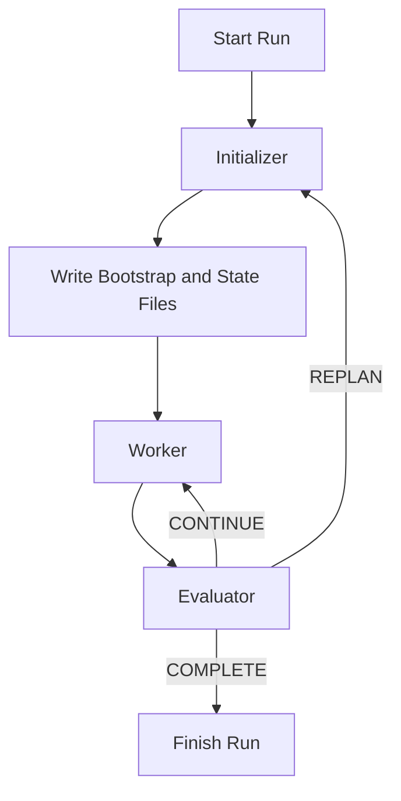

# easy-agent

[English](./README.md) | [简体中文](./README.zh-CN.md)

`easy-agent` 是一个白盒、可检查、可扩展的 Python Agent 运行时底座。

它不是某个具体业务产品，而是产品下面的那层 Agent 基础设施。这个仓库关注的是如何稳定地运行单 Agent、sub-agent、多 Agent graph、teams、tools、skills、MCP、plugins，以及长时间运行的 harness，而不是把业务逻辑直接写死在框架里。

## 这个项目到底是什么

很多 Agent 项目会直接从“调用模型”跳到“交付业务功能”。中间那层运行时工程往往会越来越乱：工具调用难以约束，长任务全靠超长 prompt，状态难恢复，协议变化还会渗透进业务代码。

`easy-agent` 的目标，就是把这层中间件显式做出来。

- 把运行时工程和业务逻辑彻底拆开。
- 把调度、编排、状态、协议适配这些能力保留为白盒，而不是藏进黑盒抽象。
- 让 tools、skills、MCP servers、plugins 可以继续挂载，而不是每次都重写核心能力。
- 让长任务有真正的 harness，而不是继续堆一个更大的 prompt。

## 适合谁用

- 需要做 Agent 产品、内部自动化平台、Agent 工作流系统的工程团队。
- 希望自己掌控调度、工具、状态恢复、协议适配的开发者。
- 需要随着模型厂商、协议、工具 schema、MCP 和多 Agent 模式演进而持续扩展的项目。

## 你能直接得到什么

- 一套显式的 `scheduler`、`orchestrator`、`registry`、`storage`、`protocol adapter` 运行时分层。
- 一套同时支持 `single_agent`、`sub_agent`、graph workflows 和 `Agent Teams` 的运行时。
- 一个真正的一等公民长任务 harness：`initializer -> worker -> evaluator`，支持可恢复 checkpoints 和持久化工件。
- 面向 `OpenAI`、`Anthropic`、`Gemini` 风格载荷的统一模型调用适配层。
- 面向 Tool Calling 2.0 的统一执行层，能承接 direct tools、command skills、Python hook skills、MCP tools 和 plugin mounting。
- 内置 session memory、event streaming、tracing、guardrails 和 public evaluation 工具。

## 技术栈

<table>
  <tr>
    <td valign="top" width="25%">
      <strong>Runtime</strong><br>
      <br>
      <br>
      <br>
      
    </td>
    <td valign="top" width="25%">
      <strong>Model Layer</strong><br>
      <br>
      <br>
      <br>
      
    </td>
    <td valign="top" width="25%">
      <strong>Execution</strong><br>
      <br>
      <br>
      <br>
      
    </td>
    <td valign="top" width="25%">
      <strong>Integration</strong><br>
      <br>
      <br>
      <br>
      
    </td>
  </tr>
</table>

## 能力一览

- 显式运行时分层，核心保留 `scheduler`、`orchestrator`、`registry`、`storage`、`protocol adapter` 等白盒能力。
- 统一适配 `OpenAI`、`Anthropic`、`Gemini` 风格的模型请求与响应。
- Tool Calling 2.0 运行时可同时承接 direct tools、command skills、Python hook skills、MCP tools 和 mounted plugins。
- 支持 `single_agent`、`sub_agent`、`multi_agent_graph`、`Agent Teams` 多种协作模式。
- 增加了一等公民的长任务 harness，具备持久化工件、显式 completion contract、由 evaluator 驱动的 continue 或 replan，以及 resumable checkpoints。
- 对直接运行、顶层 team 运行、harness 状态复用提供 session-oriented memory。
- 在工具执行前和最终输出前都有显式 guardrail hooks。
- 对模型输出的工具参数做 schema-aware validation，并提供 repair loop。
- tracing 与 event streaming 已覆盖 agent、team、tool、guardrail、harness、MCP 边界。
- 使用 SQLite 与 JSONL 持久化 runs、traces、checkpoints、session state。
- 内置 BFCL 子集与 tau2 mock 子集的 public evaluation 能力。

## 架构说明

这个运行时刻意保持白盒。关键层次是可以看见、可以替换、可以测试的。

- `scheduler` 负责 direct-agent 和 graph workflows 的调度。
- `harness` 负责长任务的 initializer、worker、evaluator 循环。
- `orchestrator` 负责 agent turn 和 team turn 的执行。
- `registry` 负责统一暴露 direct tools、skills、MCP tools 和 mounted plugin tools。
- `storage` 负责持久化 runs、traces、checkpoints、session state、harness state。
- `protocol adapters` 负责把不同模型厂商的请求和响应统一到同一个运行时接口上。

### Runtime Topology



## 长任务 Harness 设计

长任务不应该继续依赖一个越来越大的 prompt。在这个仓库里，harness 已经是运行时能力，而不是文档约定。

每个 harness 会显式定义：

- `initializer_agent`
- `worker_target`，可以是 agent，也可以是 team
- `evaluator_agent`
- `completion_contract`
- durable artifact 路径
- 有边界的 `max_cycles` 和 `max_replans`

每个 session 会落三类可恢复工件：

- `bootstrap.md`：给人看的启动与恢复说明
- `progress.md`：按 cycle 记录的进度日志
- `features.json`：给程序读取的结构化状态、决策和计数器

### Harness Loop



这部分设计参考了 Anthropic 于 2025-11-26 发布的文章 [Effective harnesses for long-running agents](https://www.anthropic.com/engineering/effective-harnesses-for-long-running-agents)。核心思想很直接：长任务真正需要的是显式协调代码、清晰的完成判定和可恢复工件，而不是只换一个更强的模型。

## 协议与工具模型

### 模型协议

- `OpenAI` 风格载荷，也包括 DeepSeek 这类 OpenAI-compatible 接口路径。
- `Anthropic` 风格载荷。
- `Gemini` 风格载荷。

### Tool Calling 2.0 运行时

同一个 registry 可以统一暴露多种来源的工具：

- direct in-process tools
- command skills
- Python hook skills
- `stdio` 或 `HTTP/SSE` 的 MCP tools
- 来自本地路径、manifest 或 entry point 的 mounted plugins

## 项目结构

```text
src/
  agent_cli/           CLI entrypoints and commands
  agent_common/        shared models and tool abstractions
  agent_config/        typed config models and validation
  agent_graph/         orchestration, graph scheduling, team runtime
  agent_integrations/  skills, MCP, plugins, sandbox, storage, guardrails
  agent_protocols/     protocol adapters and model client
  agent_runtime/       runtime assembly, harnesses, benchmarks, long-run flows, public eval
skills/
  examples/            本地演示 skills
  real/                真实验证 skills
configs/
  harness.example.yml  长任务 harness 示例
  longrun.example.yml  真实 MCP + skill 验证
  teams.example.yml    Agent Teams 示例
tests/
  unit/                快速隔离测试
  integration/         真实服务集成测试
```

## 快速开始

### 环境准备

```powershell
uv venv --python 3.12
uv sync --dev
```

### 本地凭据

运行时会自动加载本地 `.env.local` 文件。这样可以把机器私有凭据留在本地，而不用每次重新 export。

示例：

```dotenv
DEEPSEEK_API_KEY=your-key
PG_HOST=127.0.0.1
PG_PORT=5432
PG_USER=postgres
PG_PASSWORD=your-password
PG_DATABASE=postgres
REDIS_URL=redis://127.0.0.1:6379/0
```

### 常用命令

```powershell
uv run easy-agent doctor -c easy-agent.yml
uv run easy-agent skills list -c easy-agent.yml
uv run easy-agent plugins list -c easy-agent.yml
uv run easy-agent teams list -c configs/teams.example.yml
uv run easy-agent harness list -c configs/harness.example.yml
uv run easy-agent harness run delivery_loop "Create a release summary for this repository" -c configs/harness.example.yml --session-id demo-harness
uv run easy-agent harness resume <run_id> -c configs/harness.example.yml
uv run easy-agent run "summarize the repository" --session-id demo-session -c easy-agent.yml
uv run easy-agent resume <run_id> -c configs/teams.example.yml
```

### Python Runtime Example

```python
from pathlib import Path

from agent_runtime.runtime import build_runtime

runtime = build_runtime('configs/harness.example.yml')
runtime.load(Path('skills/examples'))
runtime.load('third_party_plugin')
```

## 一次 Harness 运行会留下什么

成功的 harness 运行，不只是返回一段文本。

- 它会把 run metadata 和 checkpoints 持久化到 SQLite。
- 它会流式输出 runtime events，方便 CLI 和外部观测。
- 它会落地 `bootstrap.md`、`progress.md`、`features.json`，让后续运行从显式状态继续。
- 如果你继续传同一个 `--session-id`，就可以复用之前的 harness state。

## 验证方式

当前仓库在这台机器上的主要验证路径是：

```powershell
uv run ruff check src tests scripts
uv run mypy src tests scripts
uv run python -m pytest tests/unit -q
uv run python -m pytest tests/integration -m real -q
uv run easy-agent --help
uv run easy-agent doctor -c easy-agent.yml
uv run easy-agent harness list -c configs/harness.example.yml
uv run easy-agent teams list -c configs/teams.example.yml
```

在 Windows 环境下，稳定运行 pytest 时应显式指定位于系统临时目录下的 `--basetemp`。

## 设计参考

- Anthropic, [Effective harnesses for long-running agents](https://www.anthropic.com/engineering/effective-harnesses-for-long-running-agents)
- OpenAI Agents SDK Sessions: <https://openai.github.io/openai-agents-python/sessions/>
- OpenAI Agents SDK Handoffs: <https://openai.github.io/openai-agents-python/handoffs/>
- OpenAI Agents SDK Guardrails: <https://openai.github.io/openai-agents-python/guardrails/>
- OpenAI Agents SDK Tracing: <https://openai.github.io/openai-agents-python/tracing/>
- AutoGen Teams: <https://microsoft.github.io/autogen/stable/user-guide/agentchat-user-guide/tutorial/teams.html>
- LangGraph Durable Execution: <https://docs.langchain.com/oss/python/langgraph/durable-execution>
- MCP Transports: <https://modelcontextprotocol.io/docs/concepts/transports>

## 致谢

- [Linux.do](https://linux.do/) 提供了开放的社区讨论与知识分享环境。
- [](https://www.deepseek.com/) 为本仓库的真实验证流程提供模型端点基线。

## License

MIT
