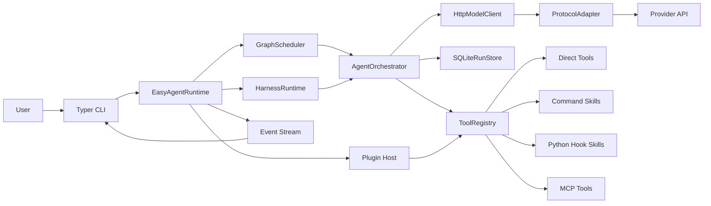
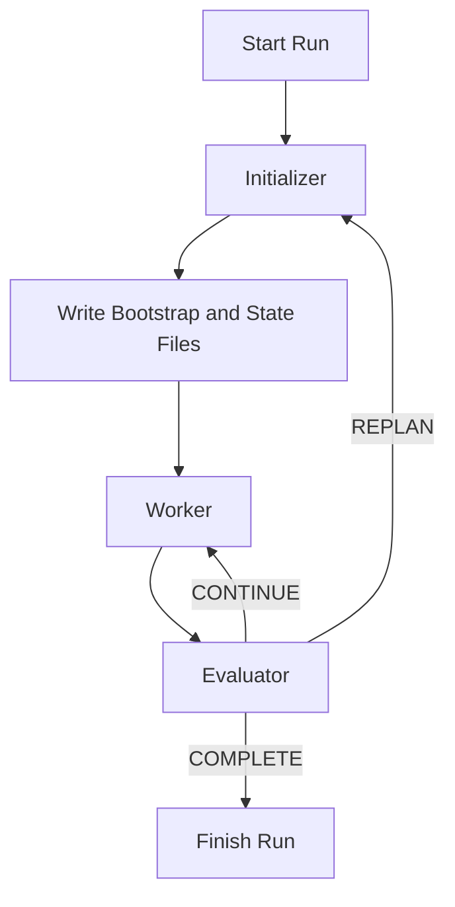

# easy-agent

[English](./README.md) | [简体中文](./README.zh-CN.md)

`easy-agent` 是一个白盒、可检查、可扩展的 Python Agent 运行时底座。

它不是某个具体业务产品，而是产品下面的那层 Agent 基础设施。这个仓库关注的是如何稳定地运行单 Agent、sub-agent、多 Agent graph、teams、tools、skills、MCP、plugins，以及长时间运行的 harness，而不是把业务逻辑直接写死在框架里。

当前发布线：`0.3.x`。这份快照对应当前补丁版本 `0.3.2`。

## 这个项目到底是什么

很多 Agent 项目会直接从“调用模型”跳到“交付业务功能”。中间那层运行时工程往往会越来越乱：工具调用难以约束，长任务全靠超长 prompt，状态难恢复，协议变化还会渗透进业务代码。

`easy-agent` 的目标，就是把这层中间件显式做出来。

- 把运行时工程和业务逻辑彻底拆开。
- 把调度、编排、状态、协议适配这些能力保留为白盒，而不是藏进黑盒抽象。
- 让 tools、skills、MCP servers、plugins 可以继续挂载，而不是每次都重写核心能力。
- 让长任务有真正的 harness，而不是继续堆一个更大的 prompt。

## 适合谁用

- 需要做 Agent 产品、内部自动化平台、Agent 工作流系统的工程团队。
- 希望自己掌控调度、工具、状态恢复、协议适配的开发者。
- 需要随着模型厂商、协议、工具 schema、MCP 和多 Agent 模式演进而持续扩展的项目。

## 你能直接得到什么

- 一套显式的 `scheduler`、`orchestrator`、`registry`、`storage`、`protocol adapter` 运行时分层。
- 一套同时支持 `single_agent`、`sub_agent`、graph workflows 和 `Agent Teams` 的运行时。
- 一个真正的一等公民长任务 harness：`initializer -> worker -> evaluator`，支持可恢复 checkpoints 和持久化工件。
- 面向 `OpenAI`、`Anthropic`、`Gemini` 风格载荷的统一模型调用适配层。
- 面向 Tool Calling 2.0 的统一执行层，能承接 direct tools、command skills、Python hook skills、MCP tools 和 plugin mounting。
- 内置 session memory、event streaming、tracing、guardrails、human approval、replay 工具、A2A 风格联邦、隔离 workbench 执行层和 public evaluation 能力。

## 技术栈

<table>
  <tr>
    <td valign="top" width="25%">
      <strong>Runtime</strong><br>
      <br>
      <br>
      <br>
      
    </td>
    <td valign="top" width="25%">
      <strong>Model Layer</strong><br>
      <br>
      <br>
      <br>
      
    </td>
    <td valign="top" width="25%">
      <strong>Execution</strong><br>
      <br>
      <br>
      <br>
      
    </td>
    <td valign="top" width="25%">
      <strong>Integration</strong><br>
      <br>
      <br>
      <br>
      
    </td>
  </tr>
</table>

## 能力一览

- 显式运行时分层，核心保留 `scheduler`、`orchestrator`、`registry`、`storage`、`protocol adapter` 等白盒能力。
- 统一适配 `OpenAI`、`Anthropic`、`Gemini` 风格的模型请求与响应。
- Tool Calling 2.0 运行时可同时承接 direct tools、command skills、Python hook skills、MCP tools 和 mounted plugins。
- 支持 `single_agent`、`sub_agent`、`multi_agent_graph`、`Agent Teams` 多种协作模式。
- 增加了一等公民的长任务 harness，具备持久化工件、显式 completion contract、由 evaluator 驱动的 continue 或 replan、resumable checkpoints，以及带审批的人审恢复门。
- 对直接运行、顶层 team 运行、harness 状态复用提供 session-oriented memory。
- 对敏感工具、swarm handoff、harness resume、MCP sampling 与 elicitation 提供 human approval 和 safe-point interrupt。
- 在工具执行前和最终输出前都有显式 guardrail hooks。
- 对模型输出的工具参数做 schema-aware validation，并提供 repair loop。
- tracing 与 event streaming 已覆盖 agent、team、tool、guardrail、harness、MCP 边界。
- 使用 SQLite 与 JSONL 持久化 runs、traces、checkpoints、session state、harness state、approval requests、interrupts 和 resume lineage。
- 为 graph 与 team workflow 提供历史 checkpoint 列表、time-travel replay，以及可分支的 `--fork` resume。
- 增加了 A2A 风格的远程 Agent 联邦，可导出本地目标、探测远程 agent card、发送或流式跟踪任务，并持久化联邦任务状态。
- 增加 executor / workbench 隔离层，用于长生命周期的 command skill、MCP 子进程、执行清单快照、TTL 清理和可分支恢复。
- MCP 已支持 roots、sampling、elicitation、`streamable_http` 与带授权感知的远程传输，并持久化 OAuth state。
- 内置 BFCL 子集与 tau2 mock 子集的 public evaluation 能力。

## Human Loop、Replay 与 MCP

这些能力现在已经是仓库的已实现功能，不再只是 roadmap 条目。

- 敏感工具在执行前可以进入人工审批，swarm handoff 与 harness resume 也会通过同一套 human loop 暂停。
- 运行时暴露 safe-point interrupt、approval queue、checkpoint list、历史 replay，以及可分支的 `resume --fork` 恢复路径。
- MCP 集成已支持显式 roots、针对 stdio filesystem server 的后向兼容 roots 推断、sampling callback、elicitation callback、`streamable_http`，以及带 OAuth 持久化状态的授权感知远程传输。
- CLI 已提供 `approvals`、`checkpoints`、`replay`、`interrupt`、`mcp roots`、`mcp auth` 等命令，无需额外写胶水代码。

## A2A Remote Agent Federation

`easy-agent` 现在提供的是一个更耐用的 A2A 风格联邦层，而不只是轮询桥接。

- `federation.server` 可以把本地 agent、team 或 harness 作为 exported target 对外发布。
- `federation.remotes` 可以探测远端 agent card，并通过 `push_preference = auto|sse|poll` 优先使用 SSE push，必要时回退到轮询。
- 联邦投递现在已经包含持久化 task event log、SSE 事件流、webhook push delivery、带退避的重试、租约续期、取消，以及更完整的 `SubscribeToTask` 生命周期跟踪。
- `agent-card` 与 `extended-agent-card` 现在会暴露 protocol version、card schema version、modalities、declared capabilities、auth hints、retry policy、subscribe policy 和 compatibility metadata。
- 联邦任务状态与订阅状态都会持久化到 SQLite，初始请求结束后依然可以继续检查远程执行和 push 交付状态。
- CLI 现在提供 `easy-agent federation list|inspect|tasks|events|subscriptions|renew-subscription|cancel-subscription|serve`。

配置形态示例：

```yaml
federation:
  server:
    enabled: true
    host: <LOCAL_HOST>
    port: 8787
    base_path: /a2a
    public_url: https://agent.example.com/a2a
    protocol_version: "0.3"
    card_schema_version: "1.0"
    retry_max_attempts: 4
    retry_initial_backoff_seconds: 0.5
  exports:
    - name: repo_delivery
      target_type: harness
      target: delivery_loop
      modalities: [text]
      capabilities: [streaming, interrupts]
  remotes:
    - name: partner
      base_url: https://partner.example.com/a2a
      push_preference: auto
      auth:
        type: bearer_env
        token_env: PARTNER_AGENT_TOKEN
```

## Executor / Workbench Isolation

运行时现在具备专门的 executor / workbench 隔离层，用来承接长生命周期代码执行、工具运行和环境任务。

- `WorkbenchManager` 会在 `.easy-agent/workbench` 下为每个 run 准备隔离根目录，并持久化每个后端 session 的 runtime state。
- `executors` 现在统一支持 `process`、`container`、`microvm` 三类后端，接口保持一致。
- command skill 和 stdio MCP server 可以通过 `skill.metadata.executor` 或 `mcp[*].executor` 绑定命名 executor，并复用同一个长生命周期 workbench session。
- graph 与 harness checkpoint 现在都会记录 workbench manifest，`resume --fork` 会把这些 manifest 克隆到新的 session root，同时保留原始 lineage。
- SQLite 会持久化 `workbench_sessions`、`workbench_executions`、runtime-state payload，以及联邦任务相关状态，便于事后追查。
- 真实网络评测矩阵已经直接覆盖 process 复用；container 和 microVM 行目前会在宿主机镜像或 SSH 资产缺失时以 `skipped` 形式展示。
- CLI 新增了 `easy-agent workbench list` 和 `easy-agent workbench gc`。

## 架构说明

这个运行时刻意保持白盒。关键层次是可以看见、可以替换、可以测试的。

- `scheduler` 负责 direct-agent 和 graph workflows 的调度。
- `harness` 负责长任务的 initializer、worker、evaluator 循环。
- `orchestrator` 负责 agent turn 和 team turn 的执行。
- `registry` 负责统一暴露 direct tools、skills、MCP tools 和 mounted plugin tools。
- `storage` 负责持久化 runs、traces、checkpoints、session state、harness state。
- `protocol adapters` 负责把不同模型厂商的请求和响应统一到同一个运行时接口上。

### Runtime Topology



## 长任务 Harness 设计

长任务不应该继续依赖一个越来越大的 prompt。在这个仓库里，harness 已经是运行时能力，而不是文档约定。

每个 harness 会显式定义：

- `initializer_agent`
- `worker_target`，可以是 agent，也可以是 team
- `evaluator_agent`
- `completion_contract`
- durable artifact 路径
- 有边界的 `max_cycles` 和 `max_replans`

每个 session 会落三类可恢复工件：

- `bootstrap.md`：给人看的启动与恢复说明
- `progress.md`：按 cycle 记录的进度日志
- `features.json`：给程序读取的结构化状态、决策和计数器

### Harness Loop



这部分设计参考了 Anthropic 于 2025-11-26 发布的文章 [Effective harnesses for long-running agents](https://www.anthropic.com/engineering/effective-harnesses-for-long-running-agents)。核心思想很直接：长任务真正需要的是显式协调代码、清晰的完成判定和可恢复工件，而不是只换一个更强的模型。

## 协议与工具模型

### 模型协议

- `OpenAI` 风格载荷，也包括 DeepSeek 这类 OpenAI-compatible 接口路径。
- `Anthropic` 风格载荷。
- `Gemini` 风格载荷。

### Tool Calling 2.0 运行时

同一个 registry 可以统一暴露多种来源的工具：

- direct in-process tools
- command skills
- Python hook skills
- `stdio`、`HTTP/SSE` 或 `streamable_http` 的 MCP tools
- 来自本地路径、manifest 或 entry point 的 mounted plugins

## 项目结构

```text
src/
  agent_cli/           CLI entrypoints and commands
  agent_common/        shared models and tool abstractions
  agent_config/        typed config models and validation
  agent_graph/         orchestration, graph scheduling, team runtime
  agent_integrations/  skills, MCP, plugins, sandbox, storage, guardrails, federation, workbench
  agent_protocols/     protocol adapters and model client
  agent_runtime/       runtime assembly, harnesses, benchmarks, long-run flows, public eval
skills/
  examples/            本地演示 skills
  real/                真实验证 skills
configs/
  harness.example.yml  长任务 harness 示例
  longrun.example.yml  真实 MCP + skill 验证
  teams.example.yml    Agent Teams 示例
tests/
  unit/                快速隔离测试
  integration/         真实服务集成测试
```

## 快速开始

### 环境准备

```powershell
uv venv --python 3.12
uv sync --dev
```

### 本地凭据

运行时会自动加载本地 `.env.local` 文件。这样可以把机器私有凭据留在本地，而不用每次重新 export。

示例：

```dotenv
DEEPSEEK_API_KEY=your-key
PG_HOST=<LOCAL_HOST>
PG_PORT=5432
PG_USER=postgres
PG_PASSWORD=your-password
PG_DATABASE=postgres
REDIS_URL=redis://<LOCAL_HOST>:6379/0
```

### 常用命令

```powershell
uv run easy-agent doctor -c easy-agent.yml
uv run easy-agent skills list -c easy-agent.yml
uv run easy-agent plugins list -c easy-agent.yml
uv run easy-agent teams list -c configs/teams.example.yml
uv run easy-agent harness list -c configs/harness.example.yml
uv run easy-agent federation list -c easy-agent.yml
uv run easy-agent workbench list -c easy-agent.yml
uv run easy-agent run "summarize the repository" --session-id demo-session --approval-mode deferred -c easy-agent.yml
uv run easy-agent approvals list --status pending -c easy-agent.yml
uv run easy-agent checkpoints <run_id> -c configs/teams.example.yml
uv run easy-agent replay <run_id> --checkpoint-id <checkpoint_id> -c configs/teams.example.yml
uv run easy-agent resume <run_id> --checkpoint-id <checkpoint_id> --fork -c configs/teams.example.yml
uv run easy-agent interrupt <run_id> --reason "human stop" -c configs/teams.example.yml
uv run easy-agent harness run delivery_loop "Create a release summary for this repository" -c configs/harness.example.yml --session-id demo-harness --approval-mode deferred
uv run easy-agent harness resume <run_id> -c configs/harness.example.yml --approval-mode deferred
uv run easy-agent mcp roots list filesystem -c configs/longrun.example.yml
uv run easy-agent mcp auth status filesystem -c configs/longrun.example.yml
```

### Python Runtime Example

```python
from pathlib import Path

from agent_runtime.runtime import build_runtime

runtime = build_runtime('configs/harness.example.yml')
runtime.load(Path('skills/examples'))
runtime.load('third_party_plugin')
```

## 一次 Harness 运行会留下什么

成功的 harness 运行，不只是返回一段文本。

- 它会把 run metadata 和 checkpoints 持久化到 SQLite。
- 它会流式输出 runtime events，方便 CLI 和外部观测。
- 它会落地 `bootstrap.md`、`progress.md`、`features.json`，让后续运行从显式状态继续。
- 如果你继续传同一个 `--session-id`，就可以复用之前的 harness state。

## 验证方式

当前仓库在这台机器上的主要验证路径是：

```powershell
.\.venv\Scripts\ruff.exe check src tests scripts
.\.venv\Scripts\mypy.exe src tests scripts
.\.venv\Scripts\python.exe -m pytest tests/unit -q --basetemp=%TEMP%\easy-agent-pytest\unit-full-<timestamp>
.\.venv\Scripts\python.exe -m pytest tests/integration -m real -q --basetemp=%TEMP%\easy-agent-pytest\integration-full-<timestamp>
.\.venv\Scripts\python.exe scripts\benchmark_modes.py --config easy-agent.yml --repeat 1 --output .easy-agent\benchmark-report.json
.\.venv\Scripts\python.exe -  # 调用 run_public_eval_suite('easy-agent.yml') 的辅助脚本
.\.venv\Scripts\python.exe -  # 调用 run_real_network_suite() 的辅助脚本
```

Python CLI smoke 也会通过 `CliRunner` 直接调用 `agent_cli.app:app` 验证 `--help`、`doctor`、`teams list`、`harness list`、`federation list`。

## 真实网络测试集结果

快照日期：2026 年 3 月 27 日。

这份快照基于 Python `3.12.11`、本地 `.env.local` 凭据、真实 DeepSeek 调用、本地 Redis/PostgreSQL 依赖，以及仓库当前的真实 MCP 集成测试生成。

### Python 验证快照

| 套件 | 命令 | 结果 |
| --- | --- | --- |
| 静态检查 | `.\.venv\Scripts\ruff.exe check src tests scripts` | passed |
| 类型检查 | `.\.venv\Scripts\mypy.exe src tests scripts` | passed |
| 单元测试 | `.\.venv\Scripts\python.exe -m pytest tests/unit -q --basetemp=%TEMP%\easy-agent-pytest\unit-full-<timestamp>` | `74 passed`，耗时 `21.93s` |
| 真实集成测试 | `.\.venv\Scripts\python.exe -m pytest tests/integration -m real -q --basetemp=%TEMP%\easy-agent-pytest\integration-full-<timestamp>` | `5 passed`，耗时 `554.53s` |
| Live benchmark 刷新 | `.\.venv\Scripts\python.exe scripts\benchmark_modes.py --config easy-agent.yml --repeat 1 --output .easy-agent\benchmark-report.json` | report refreshed |
| Live public-eval 刷新 | 调用 `run_public_eval_suite('easy-agent.yml')` 的 Python 辅助脚本 | report refreshed |
| Live real-network 刷新 | 调用 `run_real_network_suite()` 的 Python 辅助脚本 | report refreshed |
| Python CLI smoke | `CliRunner` 调用 `agent_cli.app:app` 验证 `--help`、`doctor`、`teams list`、`harness list`、`federation list` | passed |

### 真实网络矩阵

| 场景 | 传输 | 状态 | 耗时 (s) | 说明 |
| --- | --- | --- | --- | --- |
| `cross_process_federation` | `http_poll` | passed | `1.6837` | 跨进程 send/poll 联邦链路通过 |
| `disconnect_retry_chaos` | `http_webhook` | passed | `4.9721` | callback 重试、续租、取消和断线后重订阅链路通过 |
| `workbench_reuse_process` | `local_process` | passed | `1.6489` | process workbench 成功复用同一个长生命周期 session root |
| `workbench_reuse_container` | `podman_exec` | skipped | `0.0000` | 这台机器上未设置 `EASY_AGENT_CONTAINER_IMAGE` |
| `workbench_reuse_microvm` | `qemu_ssh` | skipped | `0.0000` | 这台机器上未设置 `EASY_AGENT_QEMU_BASE_IMAGE` 或 `EASY_AGENT_QEMU_SSH_KEY` |
| `replay_resume_failure_injection` | `sqlite_checkpoint` | passed | `5.8592` | 注入失败后的 resume、replay、fork 恢复链路通过 |

汇总：`4 passed`、`0 failed`、`2 skipped`。
来源：`.easy-agent/real-network-report.json`，生成时间 `2026-03-27T14:15:10Z`。

### Live Benchmark 快照

| 模式 | 成功 | 平均耗时 (s) |
| --- | --- | --- |
| `single_agent` | yes | `5.9261` |
| `sub_agent` | yes | `18.7510` |
| `multi_agent_graph` | yes | `15.8392` |
| `team_round_robin` | yes | `12.9947` |
| `team_selector` | yes | `16.9389` |
| `team_swarm` | yes | `4.9341` |

来源：本次 2026-03-27 `0.3.2` 验证过程中重新生成的 `.easy-agent/benchmark-report.json`。

### Public Eval 快照

| 套件 | 通过率 | 说明 |
| --- | --- | --- |
| `bfcl_simple` | `0.8750` | 8 个用例通过 7 个 |
| `bfcl_multiple` | `0.2500` | 8 个用例通过 2 个 |
| `bfcl_parallel_multiple` | `0.5000` | 4 个用例通过 2 个 |
| `bfcl_irrelevance` | `0.0000` | 4 个用例通过 0 个 |
| `tau2_mock` | `0.3333` | 3 个用例通过 1 个 |
| `overall.bfcl_pass_rate` | `0.4583` | 总体分数未继续上升，但长任务 MCP 链路已不再落入 schema 驱动的 `400` 失败路径 |

来源：本次 2026-03-27 live verification 过程中重新生成的 `.easy-agent/public-eval-report.json`。

当前注意事项：

- live suite 结束后仍会出现 Windows `asyncio` 子进程清理 warning，但真实测试和报告生成都已完成。
- DeepSeek 的 OpenAI-compatible endpoint 在 BFCL multiple 与 irrelevance 子集上仍会返回一部分 provider-side `400 Bad Request`；不过 harness 与 MCP 支撑的 long-run workflow 现在已经可以端到端通过。
- container 与 microVM executor 的真实网络行仍然受宿主机资源约束，只有在补齐 `EASY_AGENT_CONTAINER_IMAGE`、`EASY_AGENT_QEMU_BASE_IMAGE`、`EASY_AGENT_QEMU_SSH_KEY` 后才能从 `skipped` 转成实测。

## 下一步补强

这些下一步补强方向是根据当前公开的 A2A 与 MCP 协议面整理出来的，而不是只来自仓库内部 backlog。

- 让联邦发现与任务投递更贴近公开 A2A 接口，包括 well-known discovery、`pushNotification/set|get`，以及可断线恢复的 `sendSubscribe` / resubscribe 行为。
- 继续扩展 federation card 协商，补齐更清晰的 auth scheme hints、artifact 或 part 级别的模态声明，以及更严格的 server-to-client notification 兼容协商。
- 把 MCP 能力协商从“支持 roots”继续推进到完整的 `roots/list_changed` 流程，并加强 `streamable_http` 下的断线重连与鉴权刷新处理。
- 把 MCP sampling 与 elicitation 的策略做得更细，区分低风险与高风险远程请求，并支持更完整的 form / URL elicitation 结果处理，同时不绕过 human approval。
- 把当前受宿主机条件约束的 `container` / `microvm` executor 后端推进成可预置镜像、可快照恢复、可配置资源配额、可稳定复验的流程，让这些矩阵行从 `skipped` 变成真实覆盖。
- 继续扩展真实网络评测矩阵，加入 live-model 联邦、重复投递或 replay 韧性校验，以及 container / microVM 复用场景的真实宿主机验证。

## 设计参考

- Anthropic, [Effective harnesses for long-running agents](https://www.anthropic.com/engineering/effective-harnesses-for-long-running-agents)
- OpenAI Agents SDK Sessions: [https://openai.github.io/openai-agents-python/sessions/](https://openai.github.io/openai-agents-python/sessions/)
- OpenAI Agents SDK Handoffs: [https://openai.github.io/openai-agents-python/handoffs/](https://openai.github.io/openai-agents-python/handoffs/)
- OpenAI Agents SDK Guardrails: [https://openai.github.io/openai-agents-python/guardrails/](https://openai.github.io/openai-agents-python/guardrails/)
- OpenAI Agents SDK Tracing: [https://openai.github.io/openai-agents-python/tracing/](https://openai.github.io/openai-agents-python/tracing/)
- AutoGen Teams: [https://microsoft.github.io/autogen/stable/user-guide/agentchat-user-guide/tutorial/teams.html](https://microsoft.github.io/autogen/stable/user-guide/agentchat-user-guide/tutorial/teams.html)
- LangGraph Durable Execution: [https://docs.langchain.com/oss/python/langgraph/durable-execution](https://docs.langchain.com/oss/python/langgraph/durable-execution)
- A2A Protocol: [https://a2aprotocol.ai/](https://a2aprotocol.ai/)
- A2A Reference Implementation: [https://github.com/a2aproject/A2A](https://github.com/a2aproject/A2A)
- MCP Roots: [https://modelcontextprotocol.io/docs/concepts/roots](https://modelcontextprotocol.io/docs/concepts/roots)
- MCP Sampling: [https://modelcontextprotocol.io/docs/concepts/sampling](https://modelcontextprotocol.io/docs/concepts/sampling)
- MCP Elicitation: [https://modelcontextprotocol.io/docs/concepts/elicitation](https://modelcontextprotocol.io/docs/concepts/elicitation)
- MCP Transports: [https://modelcontextprotocol.io/docs/concepts/transports](https://modelcontextprotocol.io/docs/concepts/transports)

## 致谢

- [Linux.do](https://linux.do/) 提供了开放的社区讨论与知识分享环境。
- [](https://www.deepseek.com/) 为本仓库的真实验证流程提供模型端点基线。

## License

[Apache-2.0](https://github.com/CloudWide851/easy-agent?tab=Apache-2.0-1-ov-file#)

